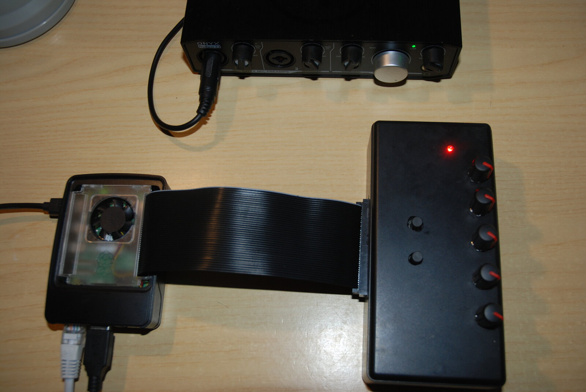
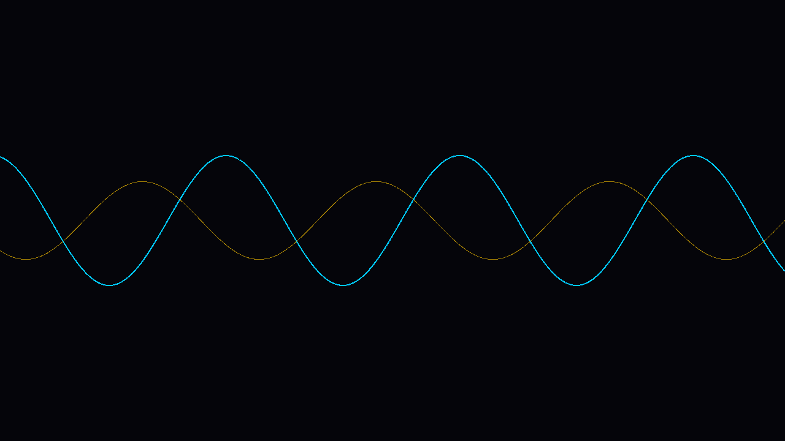
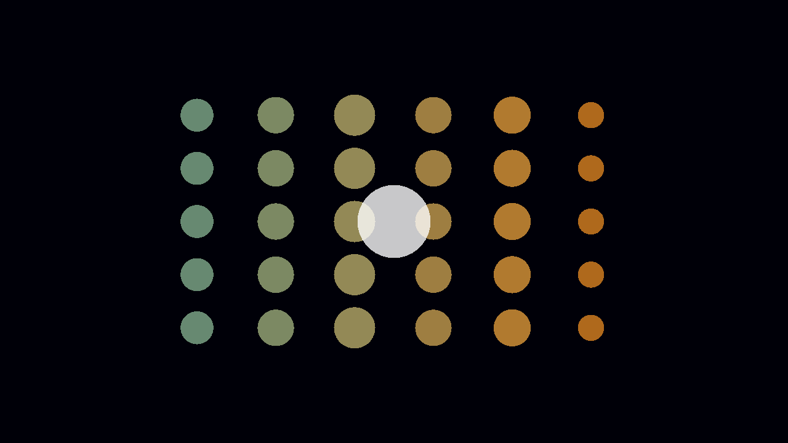
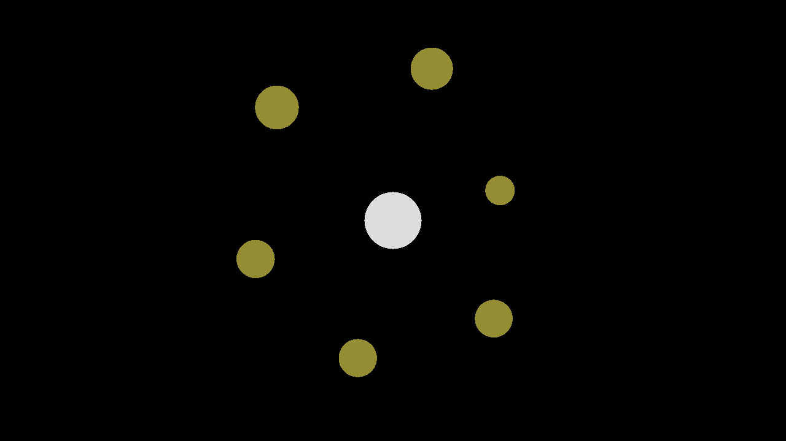
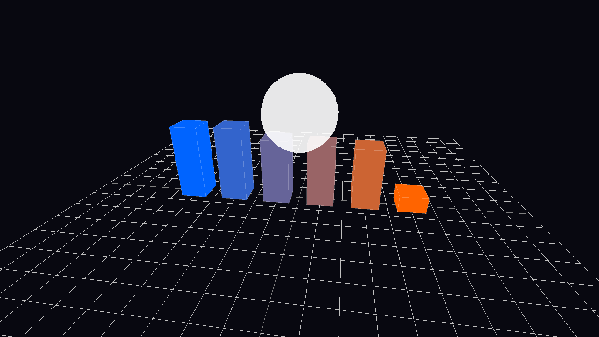

# LuaVS

Audio-reactive visualizer for the Raspberry Pi. It captures audio, extracts
features (volume, frequency bands, spectral centroid, onset) and feeds them to
**Lua** presets that draw with **raylib** (2D and 3D). Five potentiometers and
two buttons control the presets live.



## Hardware

- Raspberry Pi (tested on the Pi 5)
- USB audio capture interface (e.g. Mackie Onyx Producer)
- 5 potentiometers read via an MCP3008 ADC (SPI)
- 2 buttons on GPIO (cycle preset forward/backward)

The controls are optional: without SPI/GPIO the app still runs (pots at 0).
Wiring: [potentiometers](images/potentiometers.png) · [buttons](images/buttons.png).

## Build & run

```bash
sudo apt install build-essential cmake libfftw3-dev libasound2-dev \
  libgpiod-dev libluajit-5.1-dev libglfw3-dev libgles2-mesa-dev libegl1-mesa-dev

mkdir build && cd build
cmake ..        # first run downloads and builds raylib (needs internet)
make -j4
cd ..
./LuaVS         # ESC to quit
```

It opens fullscreen at the **1280×720** working resolution. It needs an **X11
session**, not Wayland (Wayland blocks the video mode switch):

```bash
sudo raspi-config nonint do_wayland W1   # W1 = X11, W2 = Wayland
sudo reboot
```

## Presets

Lua example files in `assets/presets/`. Each defines `preset.render(rms, centroid, onset,
bands, dt, knobs, W, H)` and draws with the functions exposed by raylib. Drop a
`.lua` there and it is immediately selectable with the buttons (no C++ changes).

|  |  |
|:---:|:---:|
| **bars_eq** — 6 bands as bars | **spline_eq** — same bands as a spline |
|  |  |
| **knob_wave** — wave driven by the pots | **knob_grid** — circle grid to try the knobs |
|  |  |
| **radial_bands** — bands in a circle | **cubes_3d** — 3D version of bars_eq |
|  |  |

## License

MIT — see [LICENSE](LICENSE).
