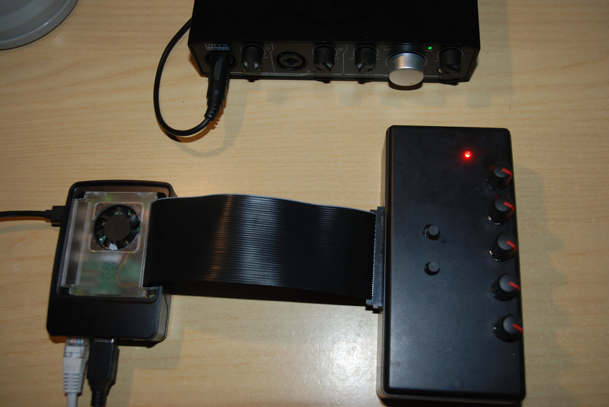
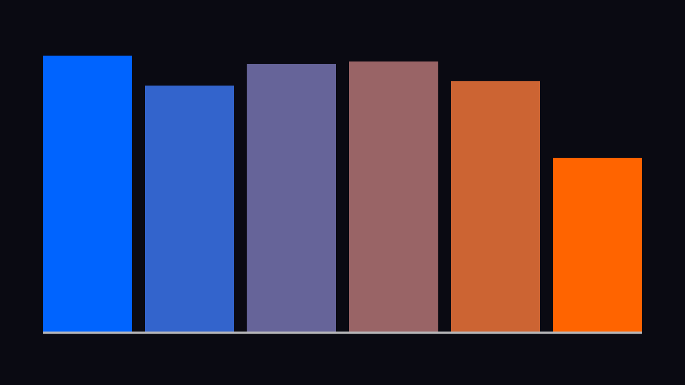
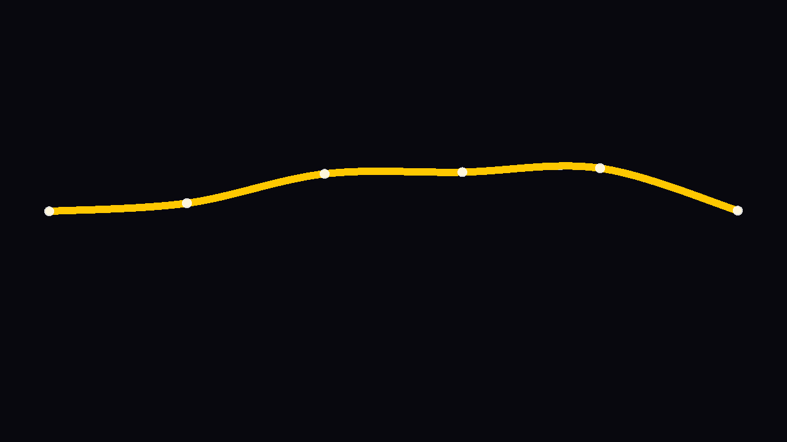
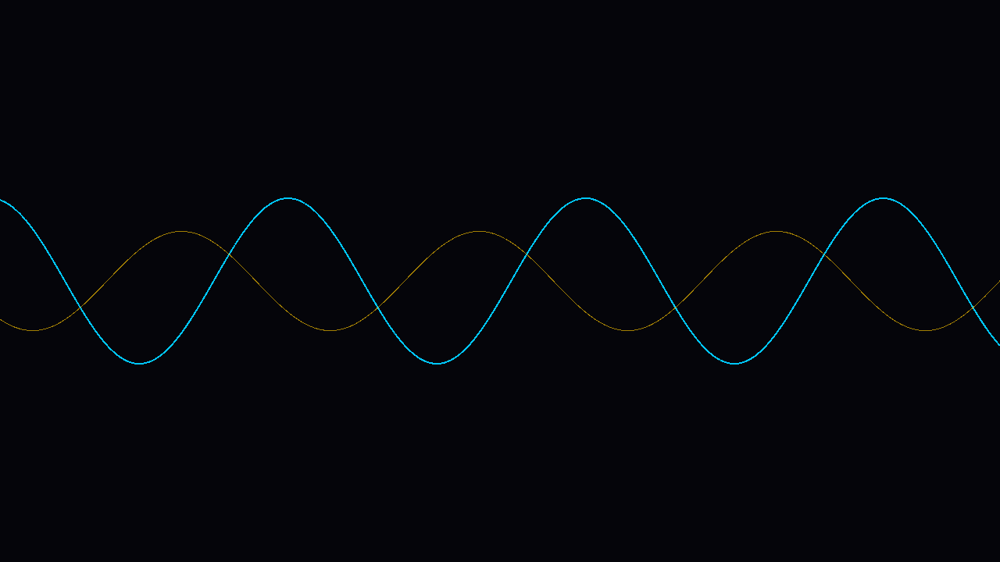
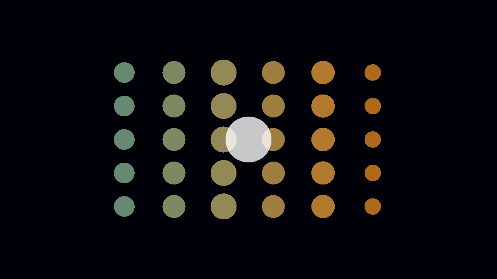
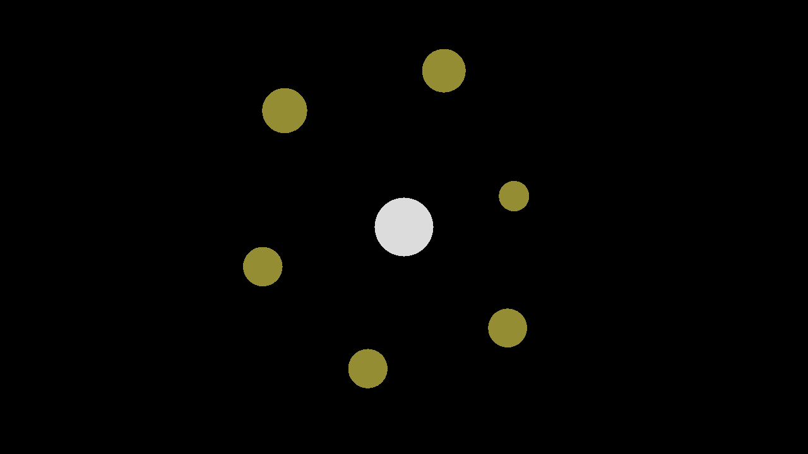
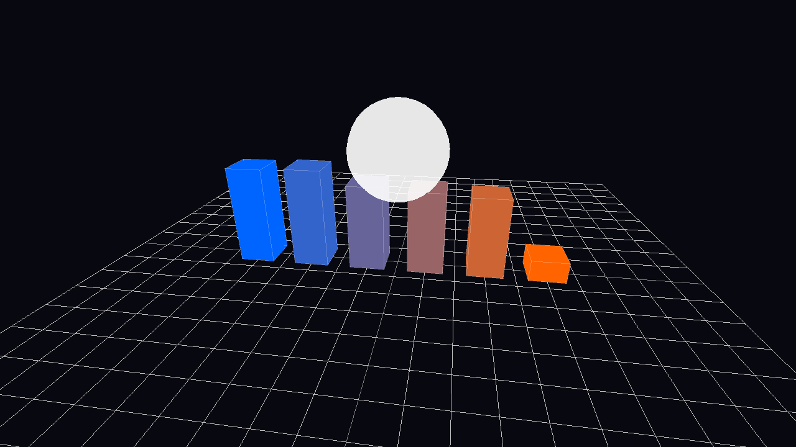

# LuaVS

Audio-reactive visualizer for the Raspberry Pi. It captures audio, extracts
features (volume, frequency bands, spectral centroid, onset) and feeds them to
**Lua** presets that draw with **raylib** (2D and 3D). Five potentiometers and
two buttons control the presets live.



## Hardware

- Raspberry Pi (tested on the Pi 5)
- USB audio capture interface (e.g. Mackie Onyx Producer)
- 5 potentiometers read via an MCP3008 ADC (SPI)
- 2 buttons on GPIO (cycle preset forward/backward)

The controls are optional: without SPI/GPIO the app still runs (pots at 0).
Wiring: [potentiometers](images/potentiometers.png) · [buttons](images/buttons.png).

## Build & run

```bash
sudo apt install build-essential cmake libfftw3-dev libasound2-dev \
  libgpiod-dev libluajit-5.1-dev libglfw3-dev libgles2-mesa-dev libegl1-mesa-dev

mkdir build && cd build
cmake ..        # first run downloads and builds raylib (needs internet)
make -j4
cd ..
./LuaVS         # ESC to quit
```

It opens fullscreen at the **1280×720** working resolution. It needs an **X11
session**, not Wayland (Wayland blocks the video mode switch):

```bash
sudo raspi-config nonint do_wayland W1   # W1 = X11, W2 = Wayland
sudo reboot
```

## Presets

Lua example files in `assets/presets/`. Each defines `preset.render(rms, centroid, onset,
bands, dt, knobs, W, H)` and draws with the functions exposed by raylib. Drop a
`.lua` there and it is immediately selectable with the buttons (no C++ changes).

|  |  |
|:---:|:---:|
| **bars_eq** — 6 bands as bars | **spline_eq** — same bands as a spline |
|  |  |
| **knob_wave** — wave driven by the pots | **knob_grid** — circle grid to try the knobs |
|  |  |
| **radial_bands** — bands in a circle | **cubes_3d** — 3D version of bars_eq |
|  |  |

## Demo
![Uploa<svg viewBox="0 0 96 96" xmlns="http://www.w3.org/2000/svg" xmlns:xlink="http://www.w3.org/1999/xlink" id="Icons_Gears" overflow="hidden"><style>
.MsftOfcResponsive_Fill_005a66 {
 fill:#005A66; 
}
</style>
<g><path d="M59.3 37.3C55.1 37.3 51.8 33.9 51.8 29.8 51.8 25.7 55.2 22.3 59.3 22.3 63.5 22.3 66.8 25.7 66.8 29.8 66.8 33.9 63.4 37.3 59.3 37.3ZM76.2 25.1C75.8 23.7 75.3 22.4 74.6 21.2L76.2 16.5 72.6 12.9 67.9 14.5C66.7 13.8 65.4 13.3 64 12.9L61.8 8.5 56.8 8.5 54.6 12.9C53.2 13.3 51.9 13.8 50.7 14.5L46 12.9 42.4 16.5 44 21.2C43.3 22.4 42.8 23.7 42.4 25.1L38 27.3 38 32.3 42.4 34.5C42.8 35.9 43.3 37.2 44 38.4L42.4 43.1 45.9 46.6 50.6 45C51.8 45.7 53.1 46.2 54.5 46.6L56.7 51 61.7 51 63.9 46.6C65.3 46.2 66.6 45.7 67.8 45L72.5 46.6 76.1 43.1 74.5 38.4C75.2 37.2 75.8 35.8 76.2 34.5L80.6 32.3 80.6 27.3 76.2 25.1Z" class="MsftOfcResponsive_Fill_005a66" fill="#4472C4"/><path d="M36.7 73.7C32.5 73.7 29.2 70.3 29.2 66.2 29.2 62 32.6 58.7 36.7 58.7 40.9 58.7 44.2 62.1 44.2 66.2 44.2 70.3 40.9 73.7 36.7 73.7L36.7 73.7ZM52 57.6 53.6 52.9 50 49.3 45.3 50.9C44.1 50.2 42.7 49.7 41.4 49.3L39.2 44.9 34.2 44.9 32 49.3C30.6 49.7 29.3 50.2 28.1 50.9L23.4 49.3 19.9 52.8 21.4 57.5C20.7 58.7 20.2 60.1 19.8 61.4L15.4 63.6 15.4 68.6 19.8 70.8C20.2 72.2 20.7 73.5 21.4 74.7L19.9 79.4 23.4 82.9 28.1 81.4C29.3 82.1 30.6 82.6 32 83L34.2 87.4 39.2 87.4 41.4 83C42.8 82.6 44.1 82.1 45.3 81.4L50 83 53.5 79.4 52 74.8C52.7 73.6 53.2 72.3 53.6 70.9L58 68.7 58 63.7 53.6 61.5C53.2 60.1 52.7 58.8 52 57.6Z" class="MsftOfcResponsive_Fill_005a66" fill="#4472C4"/></g></svg>ding 9521A4B2.svg…]()


## License

MIT — see [LICENSE](LICENSE).
